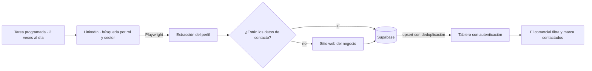

# Pipeline de prospección B2B — cuando la fuente principal no tiene el dato

**Automatización de búsqueda y enriquecimiento de prospectos para una agencia de marketing
digital.**
Código privado (cliente) · rol: diseño, construcción y operación

---

## El problema

El equipo comercial de una agencia buscaba prospectos a mano: entrar a LinkedIn, filtrar
por rol y sector, abrir cada perfil, copiar los datos a una hoja y recordar a quién ya
habían escrito. Horas de trabajo repetitivo cada semana, con dos fallos garantizados —
perfiles duplicados y perfiles que se contactan dos veces.

---

## La decisión que lo hizo funcionar: qué pasa cuando LinkedIn no tiene el dato

La primera versión hacía lo obvio: buscar en LinkedIn y guardar lo que hubiera. El problema
apareció enseguida — **muchos perfiles no publican el dato de contacto**. El comercial
recibía una lista donde una parte no servía para nada, así que volvía a buscar a mano.

La versión que sí funciona hace una segunda pasada: cuando LinkedIn no tiene lo que hace
falta, **va al sitio web del negocio a completarlo**.

Eso es lo que separa un script de un sistema. Conectar una fuente cuando todo va bien lo
hace cualquiera; el valor está en decidir qué ocurre cuando la fuente falla — y en un
catálogo real de negocios, falla la mitad de las veces.

---

## Arquitectura

- **Ejecución programada dos veces al día** sobre VPS Linux, no a demanda: la lista está
  fresca cuando el comercial abre el tablero por la mañana.
- **Deduplicación en la escritura**, con el perfil como clave única. La regla vive en la
  base de datos, no en el script: así dos ejecuciones simultáneas no pueden crear el mismo
  prospecto dos veces.
- **El tablero tiene sesión propia** y permite marcar «contactado», que es el estado que
  evita el error más caro del proceso — escribirle dos veces a la misma persona.
- **Segmentado por sector** (comercio electrónico, clínicas, inmobiliarias, marcas y
  retail), porque el mensaje comercial cambia según a quién se le escribe.

---

## Qué garantiza y qué no

**Garantiza:** que un prospecto no se duplique, y que un perfil sin datos en LinkedIn se
intente completar desde su sitio web antes de darlo por incompleto.

**No garantiza:** que todo perfil termine con datos de contacto. Algunos negocios no los
publican en ningún sitio, y el sistema lo refleja tal cual en vez de rellenar el hueco con
una suposición — un dato inventado en una lista de prospección es peor que un hueco, porque
alguien lo usa.

⚠️ **Y una limitación honesta del enfoque:** esto depende del DOM de un sitio de terceros,
que cambia sin avisar. Ningún test puede cubrir eso — cuando LinkedIn cambia su maquetado,
el scraper se rompe con las pruebas en verde. Lo que sí se puede hacer, y se hizo, es
mirar el registro de producción en lugar de confiar en los tests: así se detectaron tres
fallos encadenados que habían dejado descripciones vacías en más de noventa registros, y
se escribió una rutina que volvió a visitarlos y los completó.

---

## Stack

`Playwright` (automatización de navegador) · `Supabase` / `PostgreSQL` · `Next.js` con
autenticación · tareas programadas (`cron`) sobre VPS Linux

---

## Mi rol

Diseñé el pipeline, lo construí y lo opero: la extracción, la estrategia de respaldo al
sitio web, el esquema y su deduplicación, el tablero y la ejecución programada en el
servidor.
