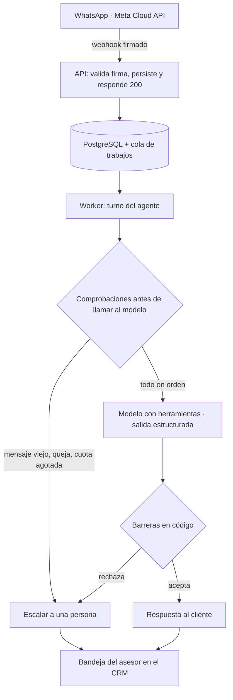

# Viantaris — un agente de IA que atiende por WhatsApp y no puede prometer de más

**CRM multi-tenant en producción, con clientes reales.**
🔗 [viantaris.com](https://viantaris.com) · código privado · rol: cofundador y desarrollador

---

## El problema

Un negocio pequeño pierde ventas por WhatsApp de una forma concreta: alguien escribe a las
nueve de la noche preguntando precio o disponibilidad, y nadie contesta hasta mañana.
Cuando contestan, el cliente ya compró en otro lado.

La solución obvia —poner un bot— tiene un riesgo peor que el problema: **un bot que promete
lo que el negocio no puede cumplir**. Confirma una cita que no existe, dice un precio
equivocado, o asegura que hay una talla que se vendió hace dos horas. Cada uno de esos
errores le cuesta al negocio un cliente enfadado, que es más caro que el mensaje sin
responder.

Todo el sistema está construido alrededor de esa asimetría.

---

## La decisión que lo define: el modelo observa, el código decide

La forma barata de evitar que el agente prometa de más es escribirlo en el prompt: *«no
confirmes una cita sin que el cliente lo pida»*. La probamos. **El modelo la ignoró.** No
siempre, pero lo suficiente como para que un paciente recibiera una cita que nadie había
pedido.

Así que cada regla que importa dejó de ser una petición y pasó a ser una comprobación en
código contra la base de datos. El modelo propone; el sistema verifica antes de dejar que
ocurra.

**Las cuatro barreras sobre la herramienta de agendar y sobre lo que se dice de precio:**

| Barrera | Qué impide |
|---|---|
| Confirmación del cliente | El agente tiene que haber hablado **y** el cliente haber escrito después. No se puede consultar y reservar en el mismo turno. |
| Horario realmente ofrecido | Solo se puede reservar un horario que la herramienta de disponibilidad devolvió en *esa* conversación. |
| Nombre dicho por el cliente | Cada palabra del nombre tiene que aparecer en algo que escribió el cliente. El nombre del perfil de WhatsApp **no cuenta**: reservar bajo un apodo ensucia la agenda del negocio. |
| Precio registrado | Si la respuesta menciona una cifra, tiene que coincidir con un precio del catálogo y corresponder a un producto que la propia respuesta nombró. |

Cada una nació de un caso real en que el modelo desobedeció una instrucción explícita.

Una consecuencia que vale la pena explicar: la barrera de precios **no bloquea hablar de
dinero**, bloquea *afirmar una cifra*. «El precio depende de lo que veamos en la valoración»
pasa intacta, porque no promete nada. Y lo que no se puede interpretar —una cantidad escrita
con letras— se resuelve escalando a una persona. El costo es una escalada de más de vez en
cuando; el costo del error contrario es un cliente que llega con un precio que nadie le va
a respetar.

---

## Arquitectura

Decisiones de fondo:

- **El webhook responde 200 de inmediato** y el trabajo real ocurre en una cola dentro de
  Postgres. Si el procesamiento falla, el mensaje no se pierde: se reintenta.
- **La cola está partida por tipo de tarea**, no solo por prioridad. Con una sola cola, una
  caída del proveedor de mensajería llena todos los huecos con reintentos de envío y el
  agente deja de responder — comprobado en una prueba de carga.
- **Una sola columna decide quién puede contestar** (`ai`, `pendiente de humano`, `humano`,
  `pausada`). El agente **nunca** se la asigna a sí mismo: solo la respuesta de una persona
  la cambia a «humano».
- **Aislamiento entre clientes por Row Level Security** en la base de datos, no por
  `if` en el código. Los datos de otro negocio sencillamente no existen para la consulta.

---

## Qué garantiza y qué no

Esta distinción es la parte del proyecto de la que estoy más satisfecho, porque es la que
normalmente no se dice.

**Garantiza** (hay un mecanismo que lo impide, y una prueba que lo demuestra):

- No se reserva una cita sin confirmación, ni en un horario no ofrecido, ni bajo un nombre
  que el cliente no dio.
- No se afirma una cifra de precio que no esté registrada.
- Dos citas no pueden ocupar el mismo espacio: lo impide una restricción del motor de base
  de datos, no una comprobación de la aplicación.
- Un mensaje que no se pudo entregar termina en un estado propio y visible, no desaparece.
- Si el modelo devuelve algo ilegible, se reintenta una vez y después contesta una persona.
  **Nunca se deja al cliente sin respuesta.**

**No garantiza:**

- Que el modelo detecte todas las quejas, ni que module el tono como se le pide. Eso es
  criterio suyo; el código solo decide qué hacer con lo que el modelo reporta.
- Que repita fielmente los datos de inventario que se le entregan. Lo verificable es **el
  dato** —sale del mismo sitio que ve el asesor en ese instante—, no la frase.

Un sistema que promete las dos listas como si fueran una sola está mintiendo en la segunda.

---

## Lo que lo mantiene en pie

Un producto que atiende clientes reales necesita más que funcionar el día que se desplegó:

- **765 pruebas automatizadas** y despliegue continuo que **revierte solo** si las
  comprobaciones de salud posteriores fallan.
- **Vigilancia cada 2 minutos desde dos máquinas independientes** — una dentro del servidor
  y otra fuera. La de dentro detecta un proceso atascado; solo la de fuera puede avisar de
  que el servidor entero dejó de responder.
- **Prueba semanal de restauración del respaldo**, no solo el respaldo. Esa prueba encontró
  dos defectos reales: una versión que reportaba «0 errores» sobre una base vacía, y una
  restricción de integridad que no volvía tras restaurar — la copia tenía todos los datos y
  ninguna protección contra reservas duplicadas.

---

## Stack

`TypeScript` · `PostgreSQL` (Row Level Security, funciones transaccionales, 58 migraciones)
· `Supabase` · `Claude API` y cualquier API compatible con OpenAI · Meta Cloud API ·
cola de trabajos sobre Postgres · `Next.js` · VPS Linux con Nginx y PM2 · GitHub Actions

**Multi-proveedor con dos adaptadores, no uno por proveedor:** casi todo el mercado habla
el dialecto de OpenAI, así que un adaptador genérico cubre OpenAI, Azure, OpenRouter, Groq,
DeepSeek, Gemini y modelos propios detrás de Ollama — con la misma red de seguridad para
todos.

---

## Mi rol

Diseñé la arquitectura, construí el backend, el agente y sus barreras, y opero la
infraestructura: despliegues, migraciones, certificados, vigilancia y respaldos. El
proyecto tiene un socio; este documento describe lo que hice yo.

También reviso el código que entra al producto. En la última revisión encontré dos defectos
con consecuencia real antes de que llegaran a producción: uno permitía que un fallo
transitorio borrara la cuenta del propietario de otro cliente, y otro dejaba entrar a una
cuenta con permisos de administrador **sin quedar registrado en la auditoría** — que era
justamente la única garantía que hacía aceptable esa función.
